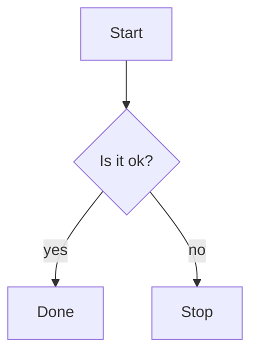

# mermaid-ascii — `{}` decision-diamond shape is not parsed; brace text becomes part of the node id

In a flowchart, a decision node written with the diamond shape `B{label}` is mis-parsed: the `{label}` shape text is taken as part of the node id, so `B{Is it ok?}` becomes a distinct literal node from `B`. The `B -->|...|` edges then bind to a phantom empty `B`, splitting one node into two and producing the wrong topology. Square brackets `B[label]` parse correctly.

## Reproduction

```bash
mermaid-ascii -f repro.mmd
```

`repro.mmd`:



## Expected

`B{Is it ok?}` should parse as node `B` with label `Is it ok?` (a decision diamond), identical to how `B[...]` is handled. All edges referencing `B` should bind to that single node — a connected `A → B → {C,D}` graph with `yes`/`no` edge labels.

## Actual

Two separate `B` nodes appear: a dead-end node literally labeled `B{Is it ok?}` (the `A --> B{Is it ok?}` target), and a phantom empty `B` that the `yes`/`no` edges attach to. The decision label is never rendered as a node and the topology is wrong.

```
┌──────────────┐     ┌──────┐
│    Start     │     │  B   ├───no────┐
└───────┬──────┘     └───┬──┘         │
        │                │            │
        │               yes           │
        ▼                ▼            ▼
┌──────────────┐     ┌──────┐     ┌──────┐
│ B{Is it ok?} │     │ Done │     │ Stop │
└──────────────┘     └──────┘     └──────┘
```

### Contrast: square brackets work

The same graph with a square node `B[Is it ok]` (see `control.mmd`) parses into one connected `A → B → {C,D}` graph with the `yes`/`no` labels on the right edges.

## Valid Mermaid

This is valid Mermaid — the snippet renders correctly (diamond + yes/no branches) in [mermaid.js](https://mermaid.live) and in `mmdr` (the Rust renderer).

## Versions

- mermaid-ascii: git rev `6fffb8e` (`1.2.0-unstable`, built 2026-04-27). No `--version` flag; the git rev is the identifier.
- OS: Linux x86_64

## Related Issue

<!-- filled in after filing -->
